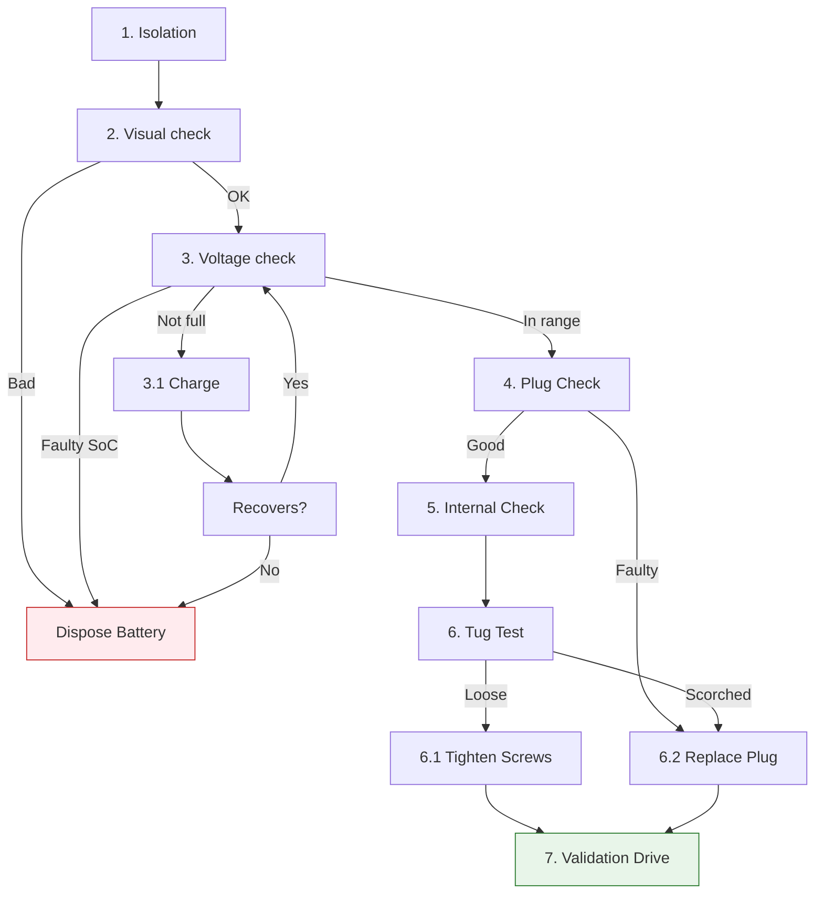

<!-- omit in toc -->
# Troubleshooting Intermittent Power Loss
<!-- omit in toc -->
## Table of content:

- [Disclaimer:](#disclaimer)
- [Document overview:](#document-overview)
- [Parameters:](#parameters)
- [Safety:](#safety)
- [Required Tools:](#required-tools)
- [Step-by-Step Instructions](#step-by-step-instructions)
- [Troubleshooting diagram:](#troubleshooting-diagram)
- [Disposal of replaced parts and batteries:](#disposal-of-replaced-parts-and-batteries)

| Document ID | Product Model | Version | Date |  
| :--- | :--- | :--- | :--- |
| SB-AES-001 | AES Akku 35.2V | v1.1 | 2026-03-21 |

---

### Disclaimer:
> [!IMPORTANT]
>- This guide is intended for qualified technicians. The manufacturer is not responsible for injury, property damage, or product damage resulting from misuse or deviation from this procedure  

### Document overview:
> [!NOTE]
>- The purpose of this document is to serve as a troubleshooting guide for intermittent power loss in AES Akku battery systems.
>
>- The table below lists important cautions:

| Caution Symbol | Description |
| :---: | :--- |
|  | Read this manual to avoid **serious injuries** or **property damage** |
|  | Sharp edges on chassis plugs or pinch points while using pliers. Wear protective gloves during internal wiring access. |
|  | Danger of sparks or flying debris could lead to eye injury or blindness. |

### Parameters:

| Parameter | Specification | Value/Limit |
| :--- | :--- | :--- |
| Nominal Voltage | Operating Voltage | 35.2V |
| Max. Charge Voltage | Cut-off Limit | 42.0V |
| Discharging Current | Max. Current | 16.5A |
| Terminal Torque | M4 Screw Torque | 1.2 Nm |
| Operating Temp. | Thermal Range | -20°C to +60°C |

---   

### Safety: 

**System:** AES Swappable Battery Interface  

 **⚠️ SAFETY CRITICAL: READ BEFORE PROCEEDING**  
 **⚠️ Omitting steps or procedures from this manual could lead to death, serious bodily injuries, or property damage.**

| Hazard Symbol | Type of Danger | Description |
| :---: | :--- | :--- |
|  | **FIRE HAZARD** | Li-ion batteries are highly flammable. Thermal runaway can release toxic gases. |
|  | **ELECTRICAL** | High Current (35.2V / 16.5A). Risk of severe arcing if shorted. **Repair only by a certified technician.** |

 * **Handling:** If the battery case is swollen, hot to the touch, or emitting a "sweet" smell, **do not proceed**. 
 * **Move the battery to a fire-safe outdoor area immediately.**  

### Required Tools:
* Phillips Screwdriver (PH2)
* Digital Multimeter
* Needle-Nose Pliers

---

### Step-by-Step Instructions

1. **Power Isolation:** 
   Remove the battery from the vehicle to ensure the circuit is broken before inspection.

2. **Battery Visual Inspection:** 
   Visually inspect the battery for swelling, abnormally hot to the touch, or a "sweet" smell; check male contacts on the battery for carbonization (burn marks) or bent contact pins. 
   - **Action:** If any of these signs occur, **safely** dispose of the battery. 

3. **Battery Voltage Verification**
   Check the battery's State of Charge (SoC). If the indicator shows "Full," measure the voltage across the primary contacts using a Digital Multimeter.
   - **Action:** 
     - If SoC is "Full" but voltage is < 35V, the battery is defective; **replace the unit.** 
     - If voltage is > 42V, the battery is defective; **replace the unit.** 
     - If SoC is not full, charge to 100% before re-testing.

4. **Chassis Plug Inspection:**
   Examine the battery interface plug inside the bike's battery holder. Look for melting plastic or widened pin-slots.

5. **Internal Wiring Access:**
   Remove the protective cover of the battery plug using a Phillips screwdriver. Inspect the primary power leads for heat damage or brittle insulation.

6. **Mechanical Tension Test (Tug Test):**
   Using Needle-Nose Pliers, gently pull the wires at the terminal block. 
   - **Action:** If wires move, tighten the terminal block screws. Replace the cable assembly if the plug housing is scorched.

7. **Validation:**
   Reinstall the battery and perform a test drive on uneven terrain to confirm power stability.

### Troubleshooting diagram:  

### Disposal of replaced parts and batteries:

>   E-bike batteries and electronic parts are **ELECTRICAL WASTE**. Do not throw **faulty battery** or replaced **electronic** parts in the black bin. Bring electronic waste to a specialized recycling center or contact the distributor for WEEE take-back. 