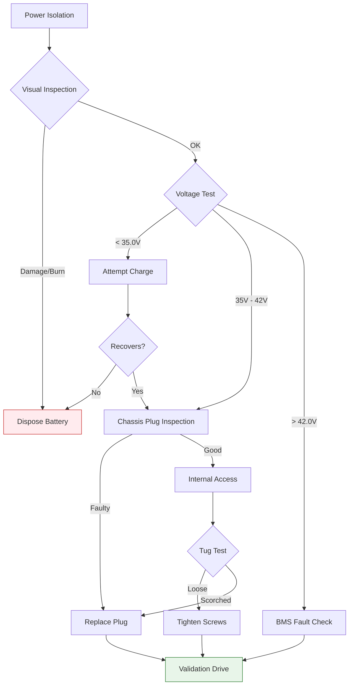

```mermaid
graph TD
    A[Power Isolation] --> B{Visual Inspection}
    
    B -- "Damage/Burn" --> Dispose[Dispose Battery]
    B -- "OK" --> C{Voltage Test}

    C -- "< 35.0V" --> E[Attempt Charge]
    C -- "35V - 42V" --> F[Chassis Plug Inspection]
    C -- "> 42.0V" --> Over[BMS Fault Check]

    E --> E_Check{Recovers?}
    E_Check -- "No" --> Dispose
    E_Check -- "Yes" --> F

    F -- "Faulty" --> G[Replace Plug]
    F -- "Good" --> H[Internal Access]

    H --> I{Tug Test}
    I -- "Loose" --> J[Tighten Screws]
    I -- "Scorched" --> G
    
    J --> K[Validation Drive]
    G --> K
    Over --> K

    style Dispose fill:#ffebee,stroke:#c62828
    style K fill:#e8f5e9,stroke:#2e7d32
```